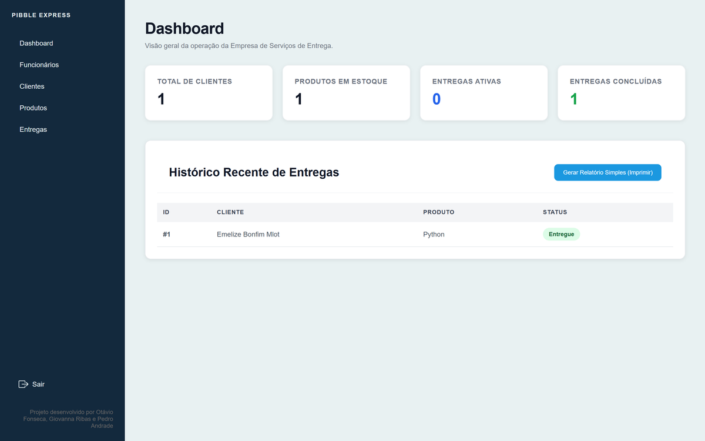
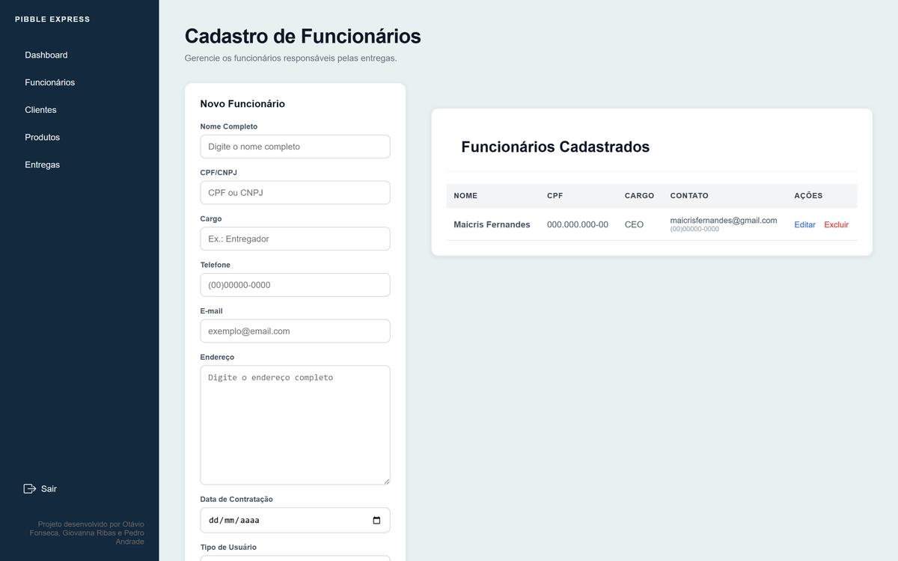

# Pibble Express

A Django web application for delivery management: registration of clients, products,
employees and deliveries, with authentication and access levels.

Team project. This is a fork of the original repository
[`rodavio/pibble_express`](https://github.com/rodavio/pibble_express), kept on
Giovanna's account for portfolio reference.

| Dashboard | Employees module |
|---|---|
|  |  |

## Team and roles

| Person | Contribution |
|---|---|
| otávio ([@rodavio](https://github.com/rodavio)) | Project creation and structure, main views, CRUD base |
| Giovanna Ribas dos Reis ([@ribasgiovanna](https://github.com/ribasgiovanna)) | Employees module and its integration with Deliveries; registration accepting CPF and CNPJ (form + migration); administrative dashboard; form standardization across the four apps and the logout button |
| Pedro Henrique de Andrade de Moraes ([profile](https://github.com/pedrooh131313)) | General adjustments |

## Features

- User authentication (login / logout) with `LOGIN_URL` at the root
- Access levels: each `Funcionario` has `tipo_usuario` `ADM` (administrator) or `FUNC`
  (employee), linked to a Django `User` through a `OneToOneField`
- Full CRUD for Clients, Products, Employees and Deliveries (list / edit / delete)
- Administrative dashboard
- Employee registration accepting either CPF or CNPJ
- Form input masks on the front end (`static/js/form-masks.js`)
- REST API (Django REST Framework) exposed at `/api/` via `DefaultRouter` for the four resources

## Tech

- Python 3, Django 6, Django REST Framework
- SQLite (development)
- HTML / CSS / JS in the templates

## Structure

```
.
├── core/              # Django project: settings, urls, login/dashboard views
├── clientes/          # app: model, form, serializer, views
├── produtos/          # app
├── funcionarios/      # app (ADM/FUNC access levels)
├── entregas/          # app
├── templates/         # base, login, dashboard, CRUD screens
├── static/            # css, js (form masks), image
└── manage.py
```

## Running

```bash
python -m venv .venv
# Windows: .venv\Scripts\activate | Linux/Mac: source .venv/bin/activate
pip install -r requirements.txt

cp .env.example .env        # set DJANGO_SECRET_KEY and DJANGO_DEBUG

python manage.py migrate
python manage.py createsuperuser
python manage.py runserver
```

Open `http://127.0.0.1:8000/`. The Django admin is at `/admin/` and the API at `/api/`.
`db.sqlite3` is created locally by `migrate` and is not version-controlled.

`SECRET_KEY`, `DEBUG` and `ALLOWED_HOSTS` are read from the environment (with a
development fallback). For production, set them in `.env` and use `DJANGO_DEBUG=False`.
